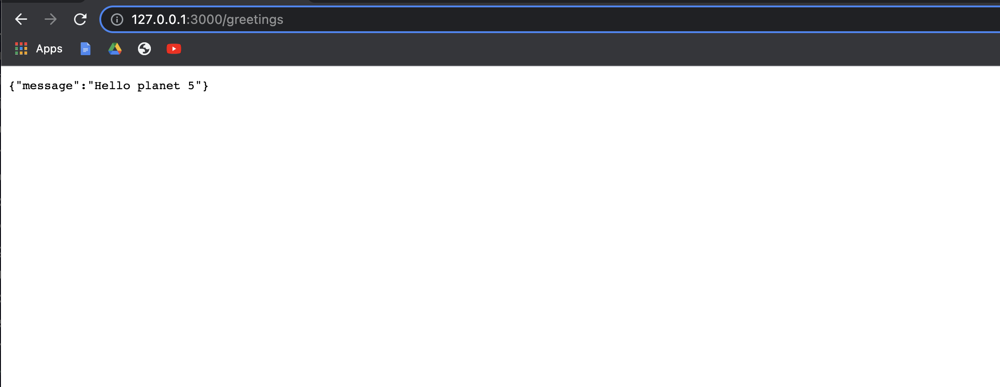

# Set up a "Hello world" project with two apps(backend)

> Hello Rails App backend



## [Frontend GitHub PR](https://github.com/Ghiftee/hello-react-front-end/pull/2)

## Built With

- Ruby on Rails
- PostgreSQL

## Getting Started

To get a local copy up and running follow these simple example steps.

### Prerequisites

- Ruby
- Rails

### Setup

- Make sure you have Ruby on Rails set up properly on your computer
- Clone or download this repo on your machine
- Enter project directory

### Install

```sh
bundle install
```

### Database

```sh

# Create the database
rails db:create

## Apply migration
rails db:migrate

# Seed database with 5 greetings
rails db:seed
```

### Run

```sh
rails s
```

## Author

👤 **Gift Uwhubetine**

- GitHub: [@Ghiftee](https://github.com/ghiftee)
- Twitter: [@Ghiftee](https://twitter.com/i_ghiftee)
- LinkedIn: [Ghiftee](https://linkedin.com/in/giftuwhubetine)


## 🤝 Contributing

Contributions, issues, and feature requests are welcome!

Feel free to check the [issues page](../../issues/).

## Show your support

Give a ⭐️ if you like this project!

## Acknowledgments

- Microverse

## License

[MIT](./LICENSE)